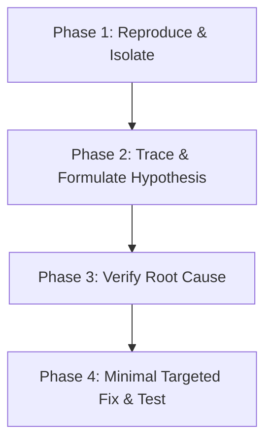

# Systematic Debugging Protocol

A strict, 4-phase methodology for isolating root causes, preventing regressions, and eliminating speculative trial-and-error fixes.

## 1. The 4-Phase Debugging Workflow

### Phase 1: Reproduce & Isolate
- Establish minimal reproduction steps or create a failing test case (Vitest, Playwright, Jest).
- Check the exact runtime environment, node version, network payloads, and browser console/terminal logs.
- Identify recent changes using `git diff` or `git log -p`.

### Phase 2: Trace & Formulate Hypothesis
- Analyze full stack traces from innermost call to entry point.
- Check state mutations and asynchronous lifecycles (race conditions, stale closures, promise rejections).
- Formulate a testable hypothesis: *"The order status fails to update because state mutation occurs before the Supabase transaction commits."*

### Phase 3: Verify Root Cause (No Guessing!)
- Add targeted assertions, temporary logs, or breakpoints at boundary conditions.
- Test edge cases (null/undefined inputs, empty arrays, concurrent calls, network timeouts).
- Confirm the hypothesis with empirical evidence before writing the permanent fix.

### Phase 4: Minimal Targeted Fix & Regression Prevention
- Apply the smallest, cleanest fix that addresses the verified root cause.
- Run test suites to ensure zero regressions across related features.
- Turn the reproduction script into a permanent automated regression test.

## 2. Common Bug Patterns & Diagnostics

| Symptom | Common Culprit | Verification Technique |
| :--- | :--- | :--- |
| **State out of sync / Stale UI** | Stale React closure, missing dependency array, mutating state in-place. | Inspect React DevTools, verify immutability. |
| **Async Race Condition** | Uncancelled in-flight requests, out-of-order responses. | Use `AbortController`, timestamp ordering. |
| **Flaky E2E Tests** | Hardcoded `sleep/timeout`, missing `waitForSelector` or network idle. | Replace timeouts with explicit assertion waits. |
| **Memory Leak** | Event listeners or subscriptions not removed on unmount. | Audit `useEffect` cleanup return functions. |
| **API 500 / CORS Errors** | Uncaught server exception, missing environment variable, incorrect header. | Inspect server-side container / function logs. |
